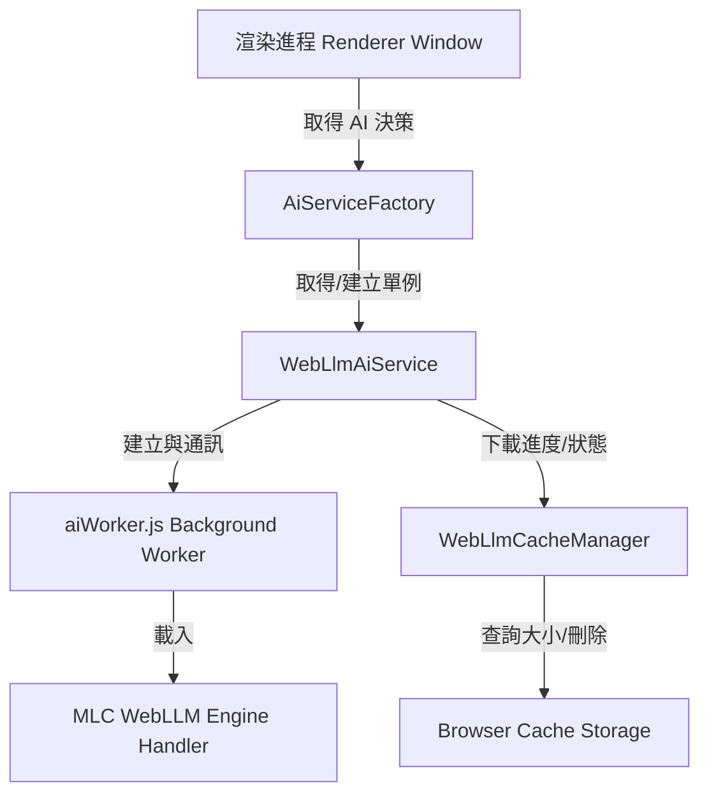

# 內建 AI 引擎 (Built-in AI Engine) 實作指南

本文件詳細說明本專案中內建 AI 引擎（基於 WebGPU 的本地大型語言模型離線推論）的架構設計、執行機制與最佳化實作。

---

## 📌 系統架構設計

專案採用 **Web Worker (多執行緒)** 的設計，將耗費大量運算與記憶體頻寬的模型加載、權重下載及 token 解碼推論工作移至背景執行，以確保大老二遊戲的 UI 畫面與音效播放保持完全流暢。



---

## 🛠️ 核心元件說明

### 1. 啟動參數與 WebGPU 硬體解鎖 (`main.js`, `env.js`, `aiWorker.js`)
為了在 Electron/Chromium 環境下支援高效能的 FP16 精度推論（特別是 modern GPU 如 AMD Radeon 780M / 8945HS），專案進行了兩個階層的解鎖：
* **主進程命令列參數**：在 Electron 的 `main.js` 初始化時，於 `app.whenReady()` 之前掛載參數：
  ```javascript
  app.commandLine.appendSwitch('enable-unsafe-webgpu');
  app.commandLine.appendSwitch('enable-webgpu-developer-features');
  ```
* **設備請求攔截器 (Monkeypatch)**：由於 WebLLM 函式庫是在背景 Worker 與 CDN 腳本中建立 WebGPU 設備，專案在 [env.js](file:///c:/Users/julia/workspace/TwBig2/src/env.js) 與 [aiWorker.js](file:///c:/Users/julia/workspace/TwBig2/src/aiWorker.js) 的最前端重寫了 `GPUAdapter.prototype.requestDevice`：
  ```javascript
  GPUAdapter.prototype.requestDevice = function (descriptor) {
      if (this.features && this.features.has('shader-f16')) {
          descriptor = descriptor || {};
          const features = descriptor.requiredFeatures ? Array.from(descriptor.requiredFeatures) : [];
          if (!features.includes('shader-f16')) {
              features.push('shader-f16');
          }
          descriptor.requiredFeatures = features;
      }
      return originalRequestDevice.call(this, descriptor);
  };
  ```
  這確保了當硬體支援時，內建 AI 引擎內部建立的邏輯設備會強制宣告支援 `'shader-f16'` 特徵，避免 WGSL Shader 中因 `enable f16;` 宣告而編譯出錯。

### 2. 背景工作執行緒 (`aiWorker.js`)
專案使用標準的 Web Worker 載入內建 AI 引擎 (WebLLM) ESM 模組，並透過 `WebWorkerMLCEngineHandler` 處理所有來自 UI 執行緒的 RPC 請求：
* **原始碼**：[aiWorker.js](file:///c:/Users/julia/workspace/TwBig2/src/services/aiWorker.js)
* **特點**：在 Worker 內部建立單一 Handler，接聽事件並無缝橋接至內建 AI 引擎的核心運算。

### 3. 本地 AI 服務類別 (`WebLlmAiService.js`)
* **路徑**：[WebLlmAiService.js](file:///c:/Users/julia/workspace/TwBig2/src/services/WebLlmAiService.js)
* **自動降級機制 (Automatic Fallback)**：
  當模型識別碼包含 `q4f16_1` 且經由 `navigator.gpu.requestAdapter()` 偵測到硬體不支援 `shader-f16` 時，服務會自動將載入的 Model ID 替換為 `q4f32_1` 版本，確保在舊款顯示卡或 macOS/Intel 內顯上依然能正常運作。
* **引擎單例快取 (`AiServiceFactory.js`)**：
  為避免在同一場對局的各個決策階段、賽後復盤分析以及自我反思 (Reflection) 中重複下載或載入模型，專案實作了單例工廠，確保全域重複使用同一個已初始化成功的內建 AI 引擎實例。

### 4. 本地快取儲存管理器 (`WebLlmCacheManager.js`)
* **路徑**：[WebLlmCacheManager.js](file:///c:/Users/julia/workspace/TwBig2/src/services/WebLlmCacheManager.js)
* **模型精準識別**：
  早期版本使用 fuzzy prefix 比對（例如比對 `gemma-2`），會導致 Gemma f16 與 f32 被歸類為同一項目，且刪除其一會連帶破壞另一個。現已改為精準的比對：
  ```javascript
  const isMatch = cacheKey.toLowerCase().includes(modelIdLower);
  ```
* **自動清理無效快取**：
  在使用者啟動遊戲或載入管理面板時，系統會自動掃描快取。若發現大小為 `0` 的空快取資料夾（通常是開啟快取但未下載產生的遺留物），會自動呼叫 `caches.delete(name)` 清除，防止 UI 顯示錯誤。
* **多國語系即時同步 (Localization Sync)**：
  清單的繪製（如顯示 `(Using f32 Compatibility)` / `(自動轉為 f32 相容版)`）會依據當前的全域與 window 語系變數來切換。系統在 `AISummarySystem` 中提供了 `updateLanguage()` 介面，並在使用者切換語系、手動點擊「管理」分頁按鈕、或點擊主畫面「i」資訊圖示時自動呼叫 `loadCacheList()` 重繪，確保 UI 與全域語系狀態即時同步。

---

## 📈 下載與並行下載安全鎖 (Mutex Lock)

為了防範使用者在模型下載尚未完成時點擊其他下載按鈕、或是多個 NPC 同時觸發預載，進而造成記憶體崩潰或頻寬互搶，專案實作了預載互斥鎖：
* **全域下載鎖**：當 `AISummaryController` 中有 active 下載時，所有其他下載觸發點 (如 AI 設定面板、NPC 資訊面板) 均會被攔截並彈出警告訊息。
* **下載狀態回寫**：每次進度更新都會回報給 `Manage` 面板，顯示精準的進度條與 % 數。

### 🔄 模型載入生命週期與資源管理 (Lazy Loading vs Preloading)
為了避免佔用過多顯示卡記憶體 (VRAM)，系統採取了以下資源優化策略：
* **已下載模型之延遲加載 (Lazy Loading)**：
  當使用者在設定中切換至一個「已經下載過（快取存在）」的模型時，背景預載器判定不需要進行檔案下載，會主動呼叫 `stopLoading()` 釋放預載執行緒（此時控制台會正常印出 `[WebLlmAiService] 模型載入已停止`），並且**不會**立刻將模型加載到 WebGPU 記憶體中。此模型會保持在硬碟快取，直至遊戲開局、輪到 AI 出牌時，才真正進行 VRAM 載入與初始化。
* **未下載模型之預載加載 (Preloading)**：
  當使用者切換到一個「尚未下載（快取不存在）」的模型時，為了呈現在背景下載模型權重檔的進度條，預載器會呼叫 `service.init()` 啟動下載，此時控制台會印出 `正在背景初始化模型: ...`，直到下載 100% 完成後，再呼叫 `stopLoading()` 關閉預載任務。

---

## 🧪 驗證與調試 (Debugging)

若要在本機驗證 WebGPU 本地推論的執行狀況，可以打開開發者工具 (F12 或 Ctrl+Shift+I)：
1. 控制台會輸出 `[WebLlmAiService] 正在背景初始化模型: ...`
2. 若硬體支援 shader-f16，且啟動參數正常，您將會看到模型順利加載（不會出現 fallback 警告）。
3. 如果硬體不支援，會輸出：
   `[WebLlmAiService] shader-f16 feature not supported by this GPU/browser. Automatically falling back...`
4. 於 `Application -> Cache Section -> Cache Storage` 中，可以看到 `webllm/model` 內存儲了所有模型的權重分塊 (chunks)。
