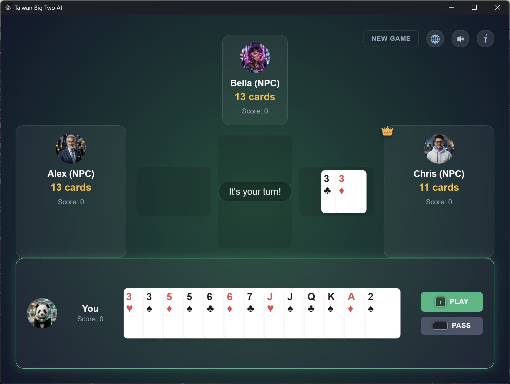
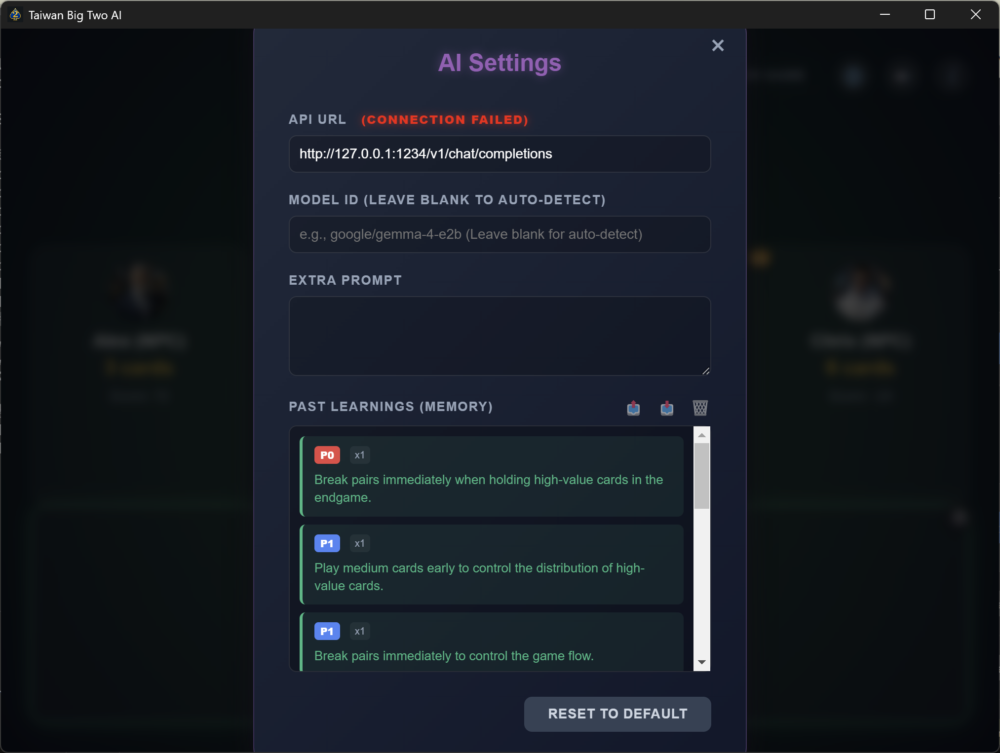
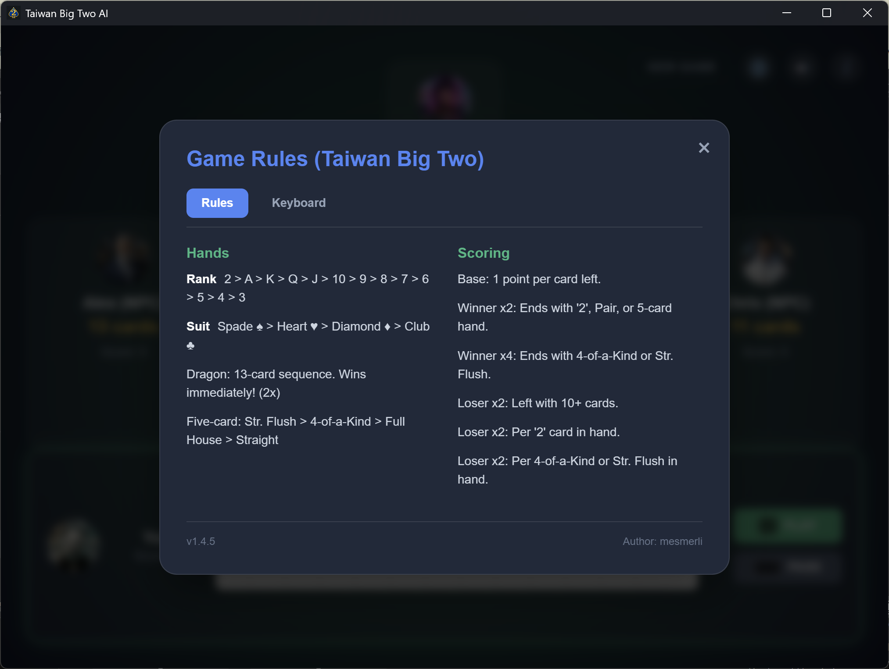
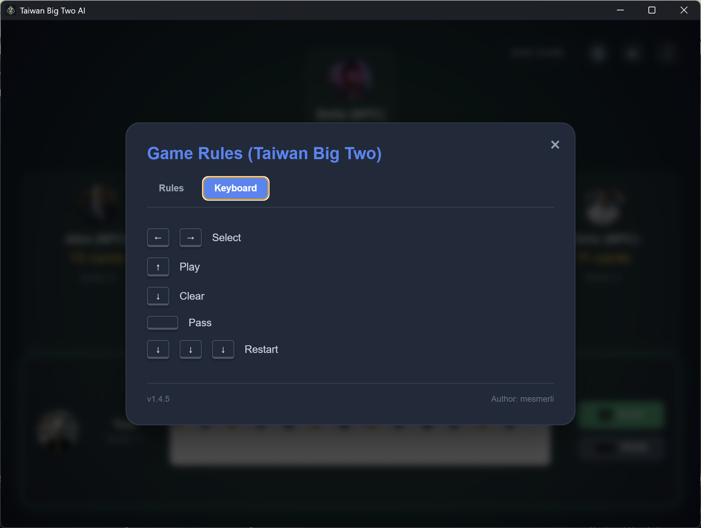
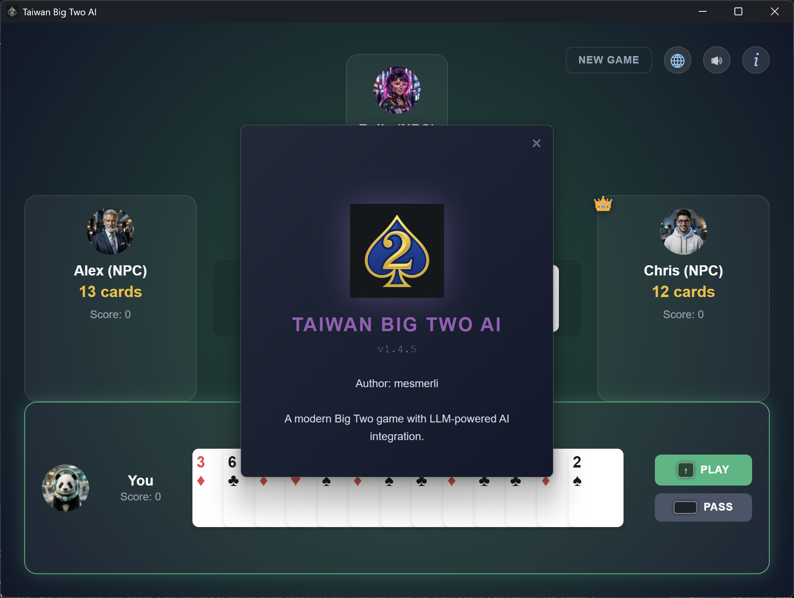

# Taiwan Big Two AI (台灣大老二 AI 版)

[](https://www.gnu.org/licenses/agpl-3.0)
[](./changelog.md)
[](https://capacitorjs.com/)

A modernized **Taiwanese Big Two** card game built with Electron. This project integrates sophisticated heuristic algorithms with an advanced multi-persona research engine powered by **Large Language Models (LLM)**, designed for autonomous strategic gameplay analysis and evolutionary learning.

### 🌐 [Play Online Directly](https://mesmerli.github.io/taiwan-big-two-ai/)

### 💡 How to get this game:
* **Support the Developer**: Purchase the official version on the **Microsoft Store** for automatic updates and easy installation.
* **Open Source**: This game is licensed under **AGPLv3**. You are welcome to clone this repository and build it yourself for free.
* **Sponsor**: If you find my AI logic helpful for your own projects, please consider a donation via **GitHub Sponsors**.

### 📸 Screenshots

<p align="center">
  
  
</p>
<p align="center">
  
  
  
</p>

---

## 🚀 Core Features

### 1. Multi-Persona Research Architecture
The project supports isolated AI personalities, each with its own memory, strategic bias, and distinct character:
- **Diana (Adaptive Learning)**: Focuses on balanced gameplay and tactical evolution.
- **Ares (The God of War)**: A high-aggression persona that prioritizes power dominance and pressure.
- **BaseLLMAI Engine**: A unified class handling card counting, board state evaluation, and **Post-Game Reflection**.

### 2. Autonomous "Self-Play" & Evolution
- **AFK Mode**: The game can run in a continuous loop, allowing AI agents to play against each other 24/7.
- **Memory Evolution**: Agents analyze losses to generate structured **"Learning Notes"** (Rule Extraction) stored in persistent JSON memory.
- **Keyword Matching**: A refined keyword similarity engine ensures strategic rules accumulate without redundancy.

### 3. Strict Taiwanese Ruleset
The engine is strictly aligned with traditional **Taiwanese Big Two** rules:
- **No Flush**: Five cards of the same suit are NOT a valid hand (unlike the HK version).
- **No Standalone Triples**: Three-of-a-kind cannot be played alone; they are only valid in Full House or Four of a Kind.
- **Hand Ranks**: Straight Flush > Four of a Kind > Full House > Straight.
- **Suit Strength**: Spade ♠ > Heart ♥ > Diamond ♦ > Club ♣.
- **Dragon**: 13-card sequence (3-2) wins immediately.

### 4. Adaptive Responsive UI (Mobile Layout)
- **Automatic Layout Toggle**: Dynamically checks window size and automatically switches between the premium widescreen desktop grid layout and the vertical stack mobile layout when width drops below `900px`.
- **Cross-Platform Consistency**: Synchronized assets and styles across Electron (desktop) and Capacitor (Android) wrappers to guarantee a fluid responsive gaming experience on all screen sizes and orientations.
- **Premium Brand Integration**: Rules and settings modal headers are updated with a high-fidelity stylized logo, complete with a purple-themed ambient glow filter.

---

## 🎮 Controls & Interaction

### 🖱️ Mouse Interface
- **New Game**: Click the **New Game** button in the top-right corner.
- **Selecting Cards**: Click on cards in your hand to select/deselect them.
- **Play / Pass**: Use the primary buttons on the human player area.
- **Mandatory Shout LA!**: If a move leaves you with exactly **one card**, you must use the **"Shout LA!"** button.
- **Visual Guide**: Click the **"i"** icon to access a tabbed guide containing both game rules and keyboard shortcuts.

### ⌨️ Keyboard Mastery (Pro Mode)
For a more efficient and professional experience, use the following shortcuts:
- **Arrow Left / Right**: Cycle through all **legal move combinations** currently in your hand.
- **Arrow Up**: Play selected cards (automatically triggers "Shout LA!" if needed).
- **Arrow Down**: 
  - **In-Game**: Deselect all currently selected cards.
  - **Post-Game**: Rapidly press **three times** to immediately start a new match.
- **Spacebar**: Pass your turn (valid only when you are not the leader).
- **Any Key**: Close the "Winner" alert modal after a match.
- **ESC**: Close any open modal (Rules, Settings, About).

---

## 🛠️ Developer & Research Tools

### Character & AI Management
- **Avatar Swap**: Click any player's **Avatar** to cycle through personalities.
- **AI Settings (⚙️)**: Configure API URL and Model ID with real-time **Connection Monitoring**.
- **Memory Management**: Export or Import learned strategic rules as JSON files.

### Build & Test Pipeline
- **Unified Testing**: Run `npm test` for full suite (Logic & UI).
- **Microsoft Store Readiness**: Full MSIX/AppX compliance with **Time-limited Trial** support.
- **Trial Interaction**: Displays remaining trial days in the top-left; supports one-click jump to the Store for purchase.
- **Native Store Bridge**: Powered by a C++ native addon (`StoreBridge`) for secure licensing.
- **Auto-Build**: Build version and artifact filenames increment automatically.
- **Icon Factory**: Automated resource generation using `winapp manifest update-assets`.

---

## 🛡️ Quality Assurance & Stability

The project includes a robust testing suite (25+ tests) to ensure rules and performance remain top-tier:
- **Automated Logic Tests**: 12 logic tests covering every card combination (Dragon, Special Straights, etc.).
- **UI & System Tests**: 18-step automated sequence verifying audio, BGM transitions, and keyboard responsiveness.
- **Asset Verification**: Automated checks for missing avatars, icons, or audio files at runtime.
- **Resilience Engine**:
  - **AI Fallback**: LLM characters automatically switch to local logic if the API is offline.
  - **Audio Safety**: Missing voice files automatically fallback to synthesized tones.
- **Scoring Accuracy**: Verified complex Taiwanese scoring formulas including 10-card and '2' multipliers.

Run tests anytime with:
```bash
npm test
```

---

## ⚙️ Using LLM with LM Studio

The "Deep Learning" AI characters (Diana & Ares) require an OpenAI-compatible API. [LM Studio](https://lmstudio.ai/) is the recommended tool for local execution.

1. **Download LM Studio**: Visit [lmstudio.ai](https://lmstudio.ai/).
2. **Download a Model**: Search for `google/gemma-4-e2b`.
3. **Start Local Server**: Go to the **Local Server** tab and click **Start Server**.
4. **Connect to Game**: Open **AI Settings (⚙️)**, paste the URL, and it will auto-detect the model.

---

## 📜 Changelog & License
- For a detailed history, see [changelog.md](./changelog.md).
- This project is licensed under the **GNU AGPL-3.0 License**.

---

## 📱 Android Mobile Build (Capacitor)

This project uses the [Capacitor](https://capacitorjs.com/) framework to package the modern web frontend as a native Android application.

### 1. Sync & Build Web Assets
```bash
# Sync web code to the native Android project
npx cap sync android
```

### 2. Compile Android Installation File (.apk) in Terminal
If you want to compile the installation file directly in the command line, you can use the built-in Gradle tool (it will automatically borrow the built-in Java environment from Android Studio):
```powershell
$env:JAVA_HOME = "C:\Program Files\Android\Android Studio\jbr"
cd android
./gradlew assembleDebug
```
* Once compiled, the APK file will be generated at: `android/app/build/outputs/apk/debug/app-debug.apk`.

### 3. Using Android Studio for Development & Debugging
1. Open Android Studio.
2. Select **Open an Existing Project**, and choose the `android` folder.
3. Once Gradle sync completes, click the **green triangle Play button (Run)** at the top to deploy and run it on an emulator or physical phone!

---
*Created with ❤️ by mesmerli for AI Strategic Research & Mobile Experience*