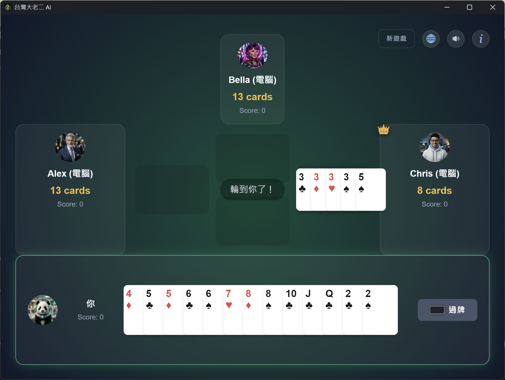
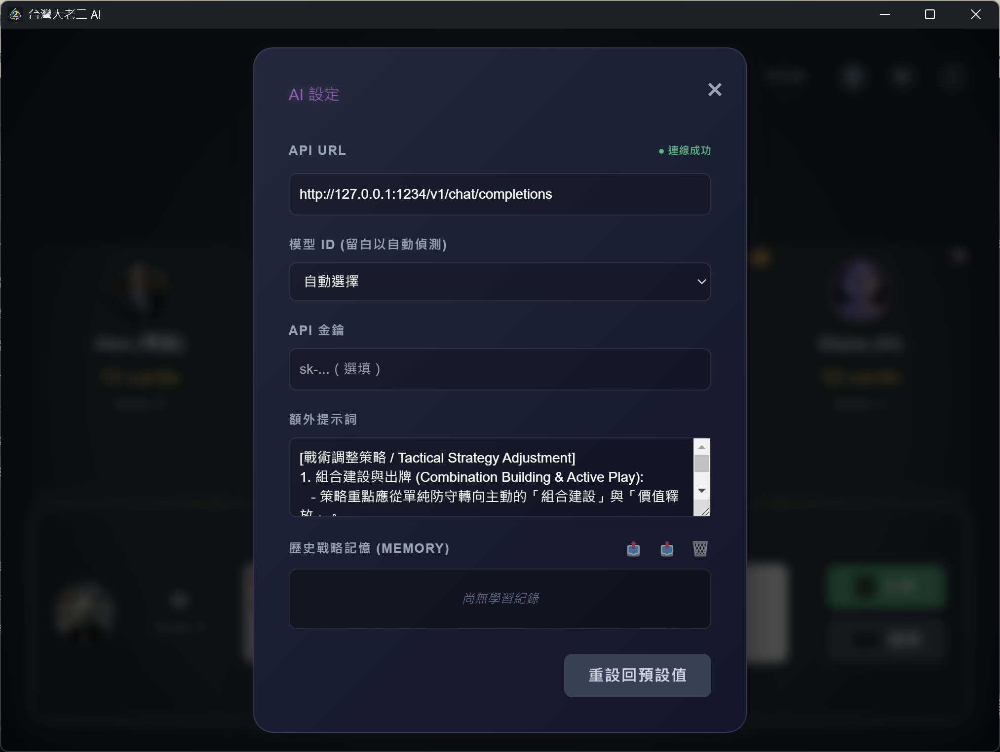
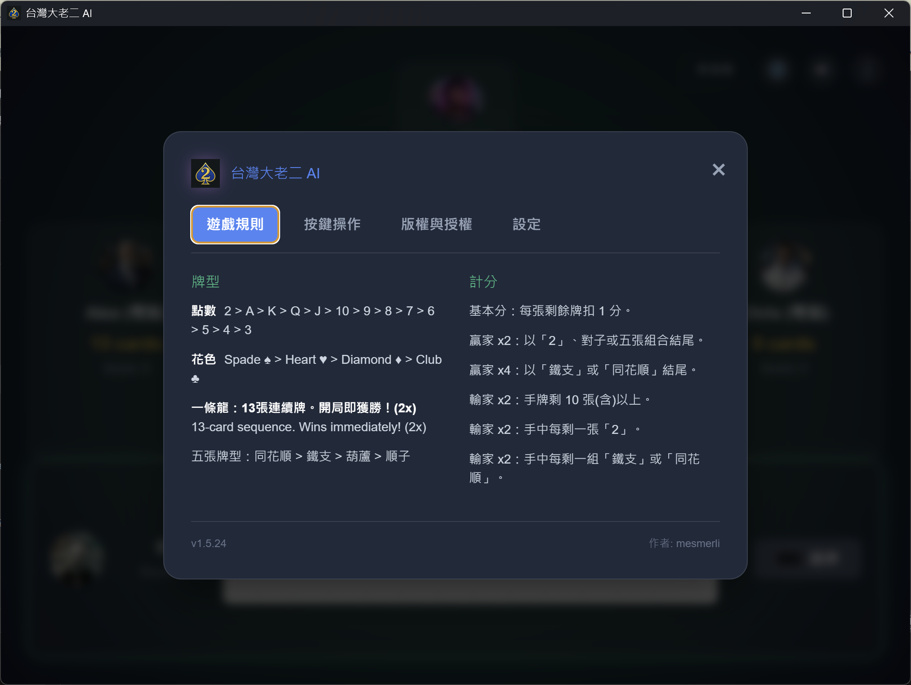
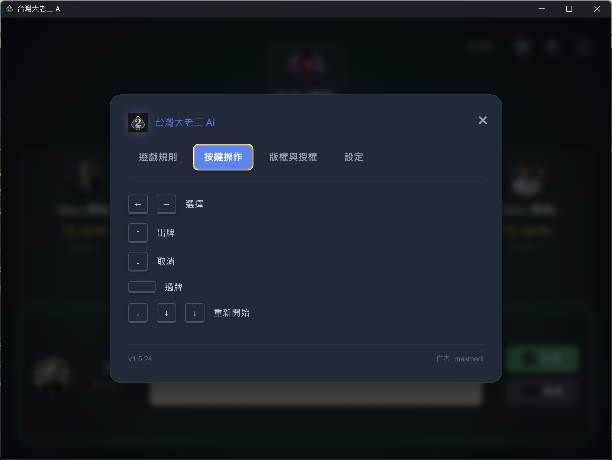
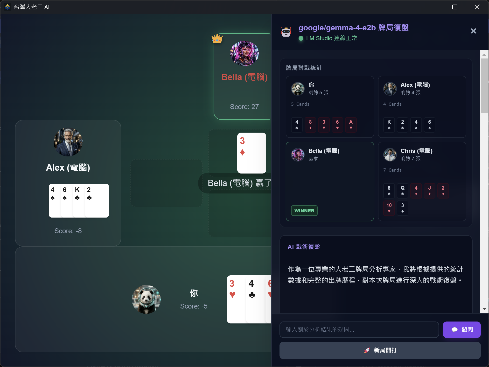
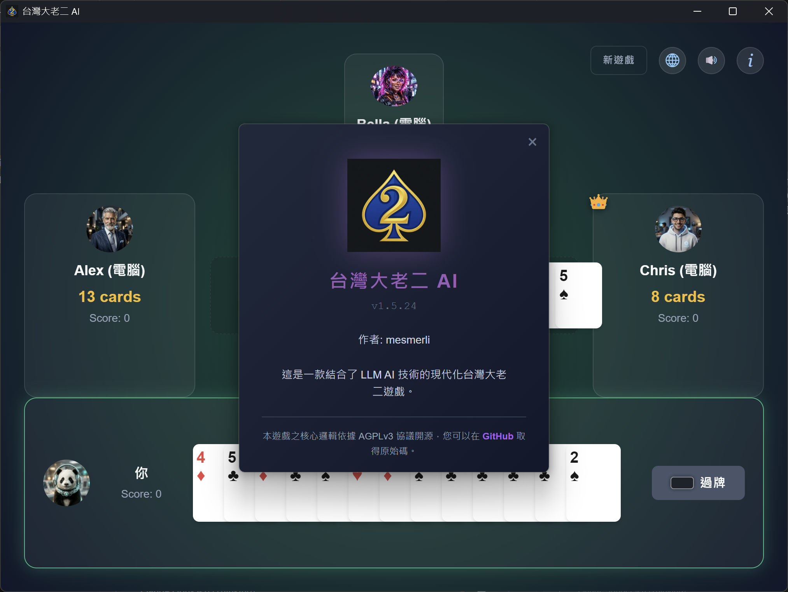

# Taiwan Big2 AI (台灣大老二 AI 版)

[](https://www.gnu.org/licenses/agpl-3.0)
[](./changelog.md)
[](https://capacitorjs.com/)
[](https://ko-fi.com/mesmerli)

本專案基於 Tauri 打造（同時支援 Electron、Android 與網頁端），是一個現代化的**台灣與香港版大老二**遊戲。它結合了高效的啟發式算法與進階的多人格大型語言模型 (LLM) 研究引擎，專為自動化戰略對弈、本地 WebGPU 執行與進化學習分析而設計。

<p align="center">
  <a href="https://mesmerli.github.io/taiwan-big-two-ai/">🌐 <b>線上直接玩 (Play Online)</b></a> &nbsp;|&nbsp;
  <a href="./release/Windows/">🖥️ <b>下載 Windows MSI</b></a> &nbsp;|&nbsp;
  <a href="./release/Android/">🤖 <b>下載 Android APK</b></a>
</p>

<p align="center">
  <a href="https://apps.microsoft.com/detail/9PM1S8GKBLK9">
    
  </a>
</p>

### 💡 如何取得此遊戲：
* **支持開發者**：歡迎在 **[Microsoft Store](https://apps.microsoft.com/detail/9PM1S8GKBLK9)** 購買官方版本，享有自動更新與便捷安裝服務。
* **Windows 版本**：請造訪 **[Windows 發佈資料夾](./release/Windows/)** 下載並安裝最新的 **`taiwan-big2-ai_1.5.52_x64_en-US.msi`** 安裝包（Tauri 版本）。
* **安卓版本**：請造訪 **[Android 發佈資料夾](./release/Android/)** 下載並安裝最新的 **`twbig2ai-1.5.52.apk`** 安裝包。
* **開源社群**：本遊戲基於 **AGPLv3** 開源授權。歡迎自由克隆 (Clone) 此儲存庫，並免費自行編譯與建置。想了解更多可參閱我們的 [建置與執行指南](./Documents/BuildnRun.md) 及 [程式碼架構说明](./Documents/architecture.md)。
* **小額贊助**：如果您覺得本專案的 AI 對抗邏輯對您的學習或專案有所幫助，歡迎透過以下方式進行贊助與支持：

  [](https://ko-fi.com/mesmerli)

### 📸 遊戲畫面

<p align="center">
  
  
</p>
<p align="center">
  
  
  
  
</p>

---

## 🚀 核心特色

### 1. 多人格研究架構 (Multi-Persona Architecture)
支援多個獨立的 AI 人格，每個角色具備專屬的記憶、戰略偏好與鮮明的個性：
- **Diana (調適型學習)**：專注於平衡的對弈風格與戰術進化。
- **Ares (戰神)**：高侵略性人格，優先考慮戰力壓制與點數打擊。
- **BaseLLMAI 引擎**：統一的類別架構，處理算牌、盤面評估與敗局後的**「自我反思 (Reflection)」**。

### 2. 全自動化對弈與進化
- **AFK 模式**：遊戲可進入全自動循環，讓 AI 代理人 24/7 持續對弈。
- **記憶進化**：AI 會在敗北後提煉結構化的**「學習筆記」**（戰略規則），儲存至持久化 JSON 記憶庫。
- **關鍵字匹配**：精煉的關鍵字相似度引擎，確保戰略規則能在不重複的情況下持續累積。

### 3. 動態規則引擎 (台灣版 vs. 香港版)
引擎採用策略模式 (Strategy Pattern)，可在設定中動態切換不同的規則集：
- **台灣版規則**：
  - **不含同花**：五張同花色但非順子的牌不能單獨打出。
  - **不含單獨三條**：三張一組的牌不能單獨打出，僅限於組成葫蘆。
  - **怪物牌型 (鐵支/同花順)**：可隨時壓制單張或對子。
  - **花色強度**：黑桃 ♠ > 紅心 ♥ > 方塊 ♦ > 梅花 ♣。
  - **起手牌**：梅花 3 ♣。
  - **順子大小**：台灣特有順子順序（例如 2-3-4-5-6 最大，A-2-3-4-5 最小）。
- **香港版規則**：
  - **可打同花**：允許單獨打出 5 張同花的牌型。
  - **可打單獨三條**：允許單獨打出三張相同數字的牌型。
  - **怪物牌型**：不能用來壓制單張或對子。
  - **花色強度**：黑桃 ♠ > 紅心 ♥ > 梅花 ♣ > 方塊 ♦。
  - **起手牌**：方塊 3 ♦。

### 4. 智慧自適應響應式介面 (Mobile Layout)
- **自動排版切換**：動態檢測視窗寬度，當視窗寬度窄於 `900px` 時自動在寬螢幕桌面版格狀佈局與手機版垂直堆疊佈局之間進行流暢切換。
- **跨平台體驗一致性**：同步 Tauri / Electron (桌面端) 與 Capacitor (Android 行動端) 的前端資源與樣式，保證所有螢幕尺寸與螢幕旋轉下的極佳流暢遊戲體驗。
- **精美品牌識別整合**：在規則說明與設定視窗的抬頭左側放上專案高解析度 Logo，並加上紫色氛圍的霓虹發光濾鏡特效。

---

## 🎮 操控與互動

### 🖱️ 滑鼠操作
- **新遊戲**：點擊右上角的 **New Game** 按鈕。
- **選取手牌**：直接點擊手中的牌即可選取或取消選取。
- **出牌 / 過牌**：使用玩家區域的主按鈕。
- **強制「喊拉！」規則**：當您的出牌動作會導致手牌只剩 **1 張**時，您必須點擊**「喊拉！」**按鈕才能繼續。
- **圖形化導覽**：點擊 **"i"** 圖示可開啟頁籤式視窗，查看完整的「遊戲規則」與「按鍵操作說明」。

### ⌨️ 鍵盤高手模式 (Pro Mode)
為了提供更高效且專業的對弈體驗，本專案支援以下快捷鍵：
- **左 / 右方向鍵**：自動循環選擇當下手中所有**合法的出牌組合**。
- **上方向鍵**：直接打出目前選取的牌組（若符合剩餘 1 張條件則自動喊拉）。
- **Enter 鍵**：直接出牌並喊拉（僅在滿足喊拉條件時有效）。
- **下方向鍵**：
  - **遊戲中**：取消目前所有選取的卡片。
  - **結算時**：**連續快速按三下**即可立即開啟新局。
- **空白鍵 (Space)**：跳過此輪（過牌）。*(僅在非領牌權時有效)*
- **任何按鍵**：在對局結束後，按任何鍵即可關閉「贏家」提示視窗。
- **ESC**：關閉目前開啟的任何彈窗（規則、設定、關於）。

---

## 🛠️ 開發者與研究工具

### 角色與 AI 管理
- **頭像切換**：點擊玩家頭像即可在不同人格之間循環切換。
- **AI 設定 (⚙️)**：設定 API URL 與模型 ID，具備**即時連線監控**功能。
- **記憶管理**：將 AI 學習到的戰略規則匯出或匯入為 JSON 檔案。

### 建置與測試流水線
- **整合式測試**：執行 `npm test` 即可運行完整的測試套件 (Logic & UI)。
- **Microsoft Store 上架支援**：支援 **「限時試用版 (Time-limited Trial)」** 完整授權機制。
- **試用版互動**：主畫面左上角即時顯示剩餘試用天數，並支援點擊標籤直接跳轉商店購買。
- **原生商店橋樑**：採用 C++ 原生插件 (`StoreBridge`) 確保與商店授權 API 的安全連接。
- **自動化建置**：版本編號與安裝檔名會在打包時自動遞增與更新。
- **圖示工廠**：使用 `winapp manifest update-assets` 自動化生成所有 Windows 資源。

---

## 🛡️ 品質保證與系統穩定性

本專案內建強大的測試套件（超過 25 項測試），確保規則與效能維持最高水準：
- **自動化邏輯測試**：12 項邏輯測試，涵蓋所有牌型判定（一條龍、特殊順子等）。
- **UI 與系統測試**：18 步自動化流程，驗證音效、背景音樂切換與鍵盤反應。
- **資源完整性檢查**：執行時自動確認頭像、圖標與 15 個音訊檔是否遺失。
- **強韌性引擎 (Resilience Engine)**：
  - **AI 自動回退**：若 API 斷線，LLM 角色會自動切換至本地 NPC 邏輯，確保遊戲不卡死。
  - **音效安全機制**：語音檔遺失時，會自動改用電子合成音反饋。
- **計分精準度**：已驗證包含「十張加倍」與「老二處罰」在內的複雜台灣計分公式。

隨時執行測試：
```bash
npm test
```

---

## ⚙️ 在本地執行 AI 模型 (WebGPU / LM Studio)

專案中的「深度學習」AI 角色 (Diana & Ares) 可以透過 WebGPU 直接在瀏覽器完全離線執行，或者連接至相容於 OpenAI 的 API 伺服器 (如 LM Studio)。

### 方案 A：啟用內建 AI 引擎 - 推薦使用 🚀
此方案利用 WebGPU 技術，直接在您瀏覽器的硬體加速背景執行緒 (Web Worker) 中載入並執行 AI 模型，完全不需架設伺服器。
1. 確保您的瀏覽器與硬體環境支援 **WebGPU**（如最新版 Chrome 或 Edge）。
2. 開啟遊戲中的 **AI 設定 (⚙️)**。
3. 勾選 **「啟用內建 AI 引擎」** 複選框。
4. 選擇模型（例如 `Qwen2.5-1.5B-Instruct-q4f32_1-MLC` 或支援 f16 的高效能版本）。模型在首次啟動時會直接下載至瀏覽器快取中（介面會顯示下載進度條），此後即可在完全斷網的環境下流暢出牌。
5. **FP16 / shader-f16 加速支援**：Electron 版本已自動啟用 WebGPU 實驗性啟動參數 (`enable-unsafe-webgpu` 與 `enable-webgpu-developer-features`)。配合對 Device 建立的攔截鉤子，當您的顯示卡硬體（如 AMD Radeon 780M / 8945HS）支援 `shader-f16` 時，系統會自動在 WGSL 中啟用 FP16 運算以達到更高推論效能。
6. **管理快取與下載**：您可以開啟遊戲資訊/規則 (**"i"**) 視窗的 **「管理」** 頁籤，在此查看各個已下載模型的佔用空間、下載進度，並能一鍵刪除快取以釋放硬碟空間。

### 方案 B：使用遠端 / 本地 API 伺服器 (LM Studio)
1. **下載 LM Studio**：造訪 [lmstudio.ai](https://lmstudio.ai/)。
2. **下載模型**：搜尋並下載 GGUF 格式的模型（例如 `gemma-2-2b-it` 或 `Qwen2.5-1.5B-Instruct`）。
3. **啟動本地伺服器**：前往 **Local Server** 分頁，將 Port 設為 `1234` 並點擊 **Start Server**。
4. **連接至遊戲**：在遊戲的 **AI 設定 (⚙️)** 中取消勾選本地 WebGPU 模式，並在 API 網址欄輸入本地伺服器端點（如 `http://127.0.0.1:1234/v1/chat/completions`），系統便會自動偵測載入的模型。

---

## 📜 更新日誌與授權
- 詳細變更紀錄請參閱 [changelog.md](./changelog.md)。
- 本專案採用 **GNU AGPL-3.0 授權條款**。

---

## 📱 Android 行動裝置版建置 (Capacitor)

本專案使用 [Capacitor](https://capacitorjs.com/) 框架，將現代化的大老二網頁前端打包成原生 Android 應用程式。

### 1. 同步與構建網頁資源
```bash
# 同步網頁代碼至 Android 原生專案
npx cap sync android
```

### 2. 在終端機一鍵產生 Android 安裝檔 (.apk)
如果您想直接在命令列編譯安裝檔，可以使用專案內置的 Gradle 工具（會自動借用 Android Studio 的內置 Java 執行環境）：
```powershell
$env:JAVA_HOME = "C:\Program Files\Android\Android Studio\jbr"
cd android
./gradlew assembleDebug
```
* 編譯完成後，安裝檔將產生於：`android/app/build/outputs/apk/debug/app-debug.apk`。

### 3. 使用 Android Studio 進行開發與調試
1. 打開 Android Studio。
2. 選擇 **Open an Existing Project**，並選取 `android` 目錄。
3. 待 Gradle 同步完成後，直接點擊頂部的 **綠色三角形 Play 鍵 (Run)**，即可在模擬器或實體手機上部署運行！

---
*由 mesmerli 為 AI 戰略研究與行動體驗精心打造 ❤️*